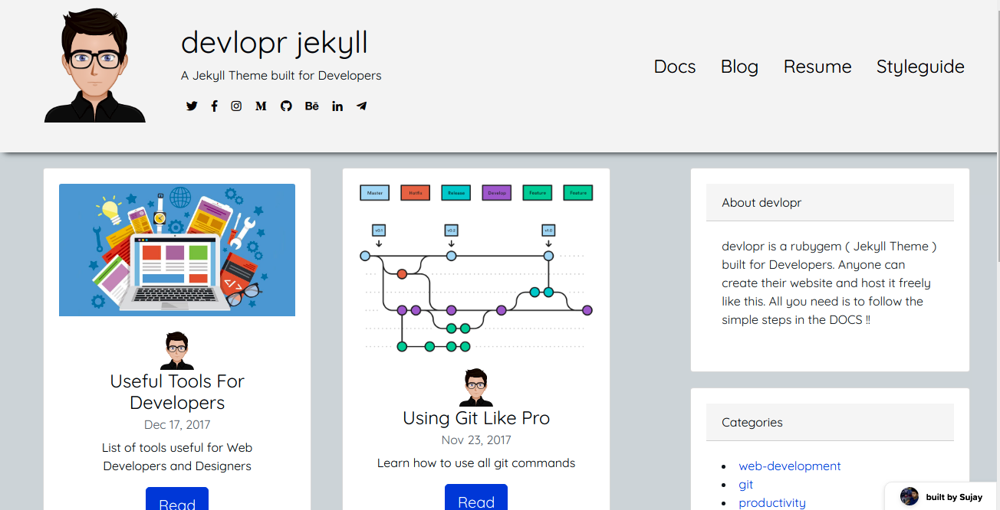
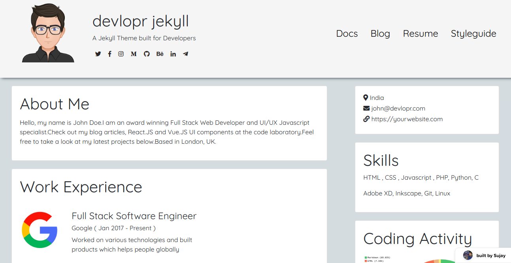

### Build a free blog using devlopr jekyll and Github Pages

### Demo - [here](https://devlopr.netlify.com)

## Build and Deploy a new blog using devlopr-jekyll theme using 3 Easy Steps - [Guide](https://devlopr.netlify.com/guides/2019/05/20/build-a-blog-using-devlopr-jekyll/)

## Screenshots:

## Licence

The theme is available as open source under the terms of the [MIT License](https://opensource.org/licenses/MIT).
